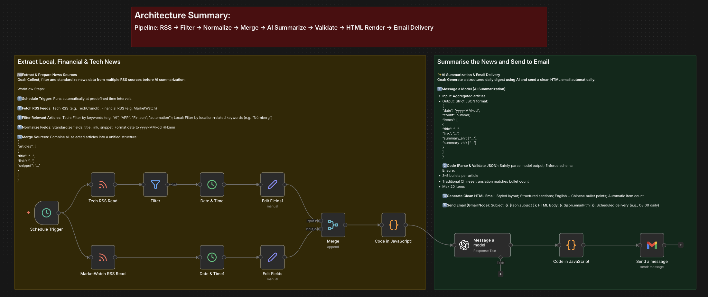
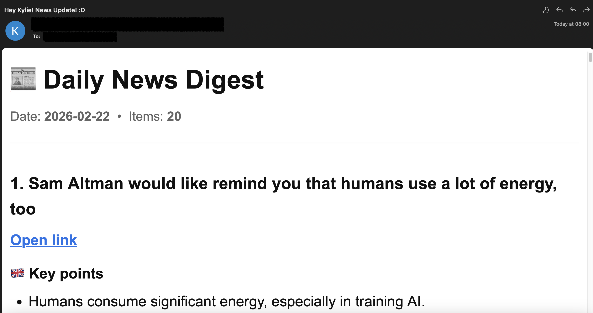

# 📰 n8n Daily News Update

An AI-powered news automation engine built with n8n.

This workflow aggregates multiple RSS feeds, filters relevant articles, normalizes data fields, performs structured LLM-based summarization with strict JSON schema validation, renders a clean HTML email, and delivers a daily news digest automatically.

---
## Workflow Overview

<p align="center">
  
</p>

## Email Preview

<p align="center">
  
</p>

## 🚀 Architecture Overview

Pipeline:

RSS → Filter → Normalize → Merge → AI Summarize → Validate → HTML Render → Email Delivery

### Key Components

- **RSS Ingestion**: Collects articles from multiple feeds (e.g., TechCrunch, MarketWatch)
- **Keyword Filtering**: Filters relevant topics (AI, Fintech, Automation, etc.)
- **Data Normalization**: Standardizes title, link, snippet, and date
- **LLM Summarization**: Generates structured multilingual summaries (EN + Traditional Chinese)
- **Schema Validation**: Enforces strict JSON output format
- **HTML Rendering**: Produces styled email-ready digest
- **Automated Delivery**: Sends scheduled daily updates via Gmail

---

## 🧠 AI Output Schema

The LLM must return:

```json
{
  "date": "yyyy-MM-dd",
  "count": number,
  "items": [
    {
      "title": "string",
      "link": "string",
      "summary_en": ["string"],
      "summary_zh": ["string"]
    }
  ]
}


